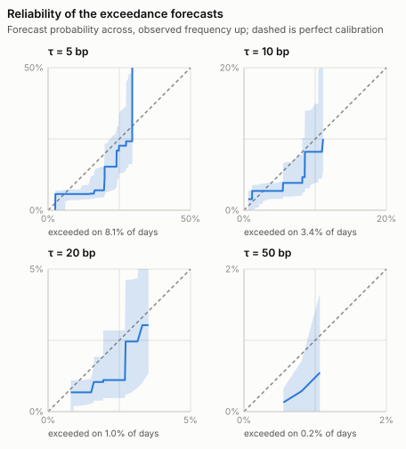

# Repo Market Model

[](https://github.com/eleonorabjornberg/repo-market-model/actions/workflows/tests.yml)
[](pyproject.toml)
[](pyproject.toml)
[](LICENSE)

**An auditable research pipeline for estimating funding pressure in the U.S. Treasury
repurchase-agreement market.**

- **Decision problem.** How likely is it that overnight repo funding costs jump away
  from the policy rate tomorrow — the condition that preceded the September 2019 and
  March 2020 funding episodes, and the one a treasurer or a risk desk would want a
  probability for rather than a point estimate.
- **Data.** Official public sources only, stored as immutable checksummed snapshots:
  the New York Fed's SOFR complex, FRED's administered-rate series, and SEC Form N-MFP
  money-fund filings, each carrying the timestamp at which it first became observable.
- **Method.** A point-in-time panel with an enforced as-of rule, purged rolling-origin
  evaluation, and probabilistic scoring — pinball loss, threshold-weighted CRPS, Brier
  skill and calibration diagnostics — against a persistence benchmark.
- **Result.** The harness is verified end to end on real market data and the persistence
  baseline is characterised over a multi-year holdout. **No model has yet met Phase
  2's exit criterion against it**: the challenger with a smaller CRPS covers its interval
  once cross-conformally calibrated, but its upper tail is weaker than persistence's and
  its tail exceedance probabilities are not yet scored.
- **Limitation.** The published interval is under its nominal coverage, the money-fund
  channel has open data-quality decisions recorded rather than resolved, and no result
  here is out-of-sample evidence of forecasting skill.

The first target is deliberately narrow: the next-business-day distribution of
`SOFR - IORB`, accompanied by SOFR dispersion and volume forecasts and the
probability that the spread exceeds predeclared stress thresholds.

This is an **academic exercise** and a portfolio project. It is not a production
trading system, not a risk-management tool, and not a source of investment advice,
and no part of it should be used to size, price, or time a position. It currently
demonstrates the data, validation, and evaluation architecture needed for credible
forecasting; it does **not** yet claim successful predictive performance on
historical market data.

<!-- generated: status -->
<!-- Generated by scripts/emit_results.py from PLAN.md. -->

**Where this is: phase 2 of 7 — Forecasting benchmarks and probabilistic ML (in progress), with phase 1, Public U.S. dataset, still open alongside it.** Its exit criterion is a model that beats persistence out of sample and remains calibrated in the tails. Next is phase 3, Latent reserves and payment needs. The machine-readable version is [`docs/status.json`](docs/status.json), regenerated in CI from the same headings rather than edited.

<!-- end generated: status -->

## Key findings

<!-- generated: key-findings -->
<!-- Generated by scripts/emit_results.py from docs/runs/. Do not edit by hand:
     the block is regenerated from the run records and checked in the suite. -->

The baseline is characterised and the scoring is verified. **No model has yet
met Phase 2's exit criterion against it**, and that criterion is open.

**Target.** The next-business-day value of the panel field `spread_bps` — the SOFR
to IORB spread in basis points — forecast from information available at 16:00
on the previous business day.

**Panel.** 2018-04-03 to 2026-09-03, 2104 rows, SHA-256 `b6af33bb7c64`.

**Evaluation.** Purged rolling origin, 6-day purge, **2080 forecast origins**,
first scored 2018-05-07, last scored 2026-09-03. Run at `04527a7`.

| Measure | Benchmark | Value | 90% interval |
|---|---|---|---|
| Mean absolute error | persistence | 3.14 bp | 2.60 to 3.79 bp |
| CRPS | persistence | 2.56 bp | not intervalled |
| Interval coverage | nominal 90% | **81.0%** | 78.3% to 83.6% |
| Pinball loss, quantile 0.05 | persistence | 0.95 bp | not intervalled |
| Pinball loss, quantile 0.25 | persistence | 1.46 bp | not intervalled |
| Pinball loss, quantile 0.50 | persistence | 1.58 bp | not intervalled |
| Pinball loss, quantile 0.75 | persistence | 1.51 bp | not intervalled |
| Pinball loss, quantile 0.95 | persistence | 0.90 bp | not intervalled |

The interval is a stationary bootstrap, block length 5, 2000 replications, on the errors themselves; the folds overlap in horizon, so a formula assuming independent draws would report a narrower interval than the data supports.

**The coverage line is the honest one, and it is a finding.** A nominal 90% interval covered 81.0% of 2080 realised outcomes. Intervalled the same way as the error above (stationary bootstrap, block length 5, 2000 replications, seed 1755593764), the realised coverage lies between 78.3% and 83.6%, which excludes the nominal probability. What the gap is — a miscalibrated benchmark, or one a challenger will improve on — is open, and no verdict is asserted in the suite.

**Challengers against persistence.** Each challenger is scored on the same 2039 origins (minimum history 61, purge 6 days); persistence's CRPS is 2.53 bp. The difference is persistence's CRPS minus the challenger's, so a positive value favours the challenger; its interval is a stationary bootstrap (block length 5, 2000 replications) on the per-origin differences.

| Challenger | CRPS | Difference | 90% interval | Verdict |
|---|---|---|---|---|
| gbm (spread change lags `1`) | 1.98 bp | +0.55 bp | +0.28 to +0.88 bp | beats persistence |
| gbm (spread change lags `5`) | 1.98 bp | +0.55 bp | +0.27 to +0.88 bp | beats persistence |
| gbm | 1.99 bp | +0.54 bp | +0.27 to +0.87 bp | beats persistence |
| gbm (volatility feature `garch11`) | 2.00 bp | +0.52 bp | +0.25 to +0.86 bp | beats persistence |
| gbm (calibration `cross_conformal`, calibration folds `5`) | 2.02 bp | +0.51 bp | +0.24 to +0.85 bp | beats persistence |
| rolling-residual (residual window `60`) | 2.48 bp | +0.05 bp | +0.02 to +0.08 bp | beats persistence |
| gbm (calibration `conformal`, calibration share `0.25`) | 2.71 bp | -0.18 bp | -0.49 to +0.19 bp | not distinguishable |
| gbm (calibration `conformal`, calibration share `0.25`, spread change lags `1`) | 2.72 bp | -0.19 bp | -0.50 to +0.18 bp | not distinguishable |
| gbm (calibration `conformal`, calibration share `0.25`, spread change lags `5`) | 2.73 bp | -0.20 bp | -0.51 to +0.17 bp | not distinguishable |
| gbm (calibration `conformal`, calibration share `0.25`, volatility feature `garch11`) | 2.76 bp | -0.23 bp | -0.54 to +0.15 bp | not distinguishable |
| arx with `sofr_volume` | 2.90 bp | -0.37 bp | -0.53 to -0.21 bp | loses to persistence |
| arx with `sofr_p25`, `sofr_p75` | 2.93 bp | -0.40 bp | -0.60 to -0.21 bp | loses to persistence |
| threshold (regime variable `sofr_volume`) | 4.20 bp | -1.67 bp | -4.25 to -0.03 bp | loses to persistence |
| threshold (regime variable `spread_bps`) | 4.69 bp | -2.16 bp | -4.28 to -0.50 bp | loses to persistence |

**Interval coverage on the same origins.**

| Model | Nominal | Realised coverage | 90% interval | Pinball loss, quantile 0.95 |
|---|---|---|---|---|
| gbm (calibration `conformal`, calibration share `0.25`) | 90% | 85.5% | 83.2% to 87.7% | 1.294 bp |
| gbm (calibration `cross_conformal`, calibration folds `5`) | 90% | 93.1% | 91.6% to 94.6% | 1.130 bp |
| gbm | 90% | 65.8% | 63.2% to 68.3% | 0.943 bp |
| persistence | 90% | 81.6% | 78.8% to 84.2% | 0.889 bp |

A realised-coverage interval that excludes the nominal probability is a calibration finding. It is one for: gbm (calibration `conformal`, calibration share `0.25`), gbm (calibration `cross_conformal`, calibration folds `5`), gbm, persistence.

**The control that licenses every future skill number.** A climatology scored against climatology must show no skill. Over the same 2080 origins its Brier skill score is 0.000 at every declared threshold (5, 10, 20, 50 bp), and its reference Brier score equals its own at each one. Any skill this repository later reports rests on that having been true first.

<picture>
  <source media="(prefers-color-scheme: dark)" srcset="docs/figures/reliability-dark.svg">
  
</picture>

CORP reliability curves with 90% stationary-bootstrap bands, one panel per declared stress threshold. The diagonal is perfect calibration; the base rate under each panel is how often the threshold was actually exceeded.

<!-- end generated: key-findings -->

## Quick start

Requirements: Python 3.9, 3.10 or 3.11. The supported range is declared once in
`pyproject.toml` and is checked against the interpreter that runs the suite; 3.12
moves the published figures in their last digits and is outside it. The project intentionally uses
only the Python standard library for everything a published result depends on except
the gradient-boosted comparison, which needs the extra below; reproducing any other
needs no package installation. Phase 2's machine-learning candidates live
in `src/repo_model/ml.py` behind an optional extra, `pip install '.[ml]'` (numpy and
scikit-learn); today that is one, gradient-boosted conditional quantiles (`--model gbm`), with four opt-in
settings: a conformal interval (`--calibration conformal`, or `cross_conformal` with
`--calibration-folds K`), lagged spread changes (`--spread-change-lags K`), a GARCH(1,1)
variance fitted per fold (`--volatility-feature garch11`) and an ARX one-step forecast fitted
per fold (`--arx-feature declared`). All but the ARX feature are scored in Key findings.

```bash
git clone https://github.com/eleonorabjornberg/repo-market-model.git
cd repo-market-model

PYTHONDONTWRITEBYTECODE=1 PYTHONPATH=src \
  python3 -B -m unittest discover -s tests

PYTHONPATH=src python3 -m repo_model.cli audit data/sample/daily_market.csv
PYTHONPATH=src python3 -m repo_model.cli backtest data/sample/daily_market.csv \
  --registry metadata/sources.json \
  --feature spread_bps \
  --decision-time 16:00 \
  --model persistence \
  --report /tmp/persistence_sample.json
```

The sample file is synthetic and exists only to make the workflow executable.
For data acquisition and exact reproducibility boundaries, see
[`REPRODUCIBILITY.md`](REPRODUCIBILITY.md).

## Why this project

Repo-market stress is a useful test of financial modeling discipline. The most
dangerous failure is often not a visibly broken model but a convincing backtest
that used information before it was actually available. This repository therefore
treats point-in-time availability, data provenance, release lags, revisions, and
holdout design as first-class parts of the model.

The intended research question is:

> Can publicly observable funding, reserve, Treasury-settlement, dealer,
> money-fund, and calendar variables forecast the next-day distribution of
> Treasury repo-market pressure, including transitions into the upper tail?

## Current status

Implemented:

- a versioned point-in-time data contract and panel builder;
- immutable, checksummed snapshots from official public sources;
- source, publication-lag, revision, and availability metadata;
- validation, missingness, provenance, and accounting checks;
- a persistence benchmark with empirical prediction intervals;
- purged rolling-origin evaluation for the main scoring holdout;
- frozen, checksummed event windows for separate knowledge holdouts;
- probabilistic metrics, including pinball loss, threshold-weighted CRPS,
  Brier skill, calibration diagnostics, and stationary-bootstrap intervals; and
- a standard-library test suite of leakage and mutation-oriented guards. Its
  size is deliberately not quoted here: a count transcribed into prose is stale
  at the next commit, and a repository about point-in-time honesty should not
  publish one. The badge above and the CI log are the count.

Still in progress:

- validating complete SEC Form N-MFP monthly cross-sections; and
- producing genuine out-of-sample and event-window results.

See
[`docs/PROJECT_STATUS.md`](docs/PROJECT_STATUS.md) for the current boundary between
implemented infrastructure and open research work.

## Research design

The project follows six rules:

1. Features must be timestamped by when they became observable, not merely by the
   date they describe.
2. Random train/test splits are prohibited; evaluation follows time.
3. Scoring holdouts and historically important event windows have different roles
   and are reported separately.
4. Missing observations, structural zeros, and unavailable cross-sections remain
   distinguishable.
5. Stress probabilities come from the same predictive distribution as the
   quantile forecasts, rather than from unrelated classifiers.
6. Predictive results are not presented as causal policy estimates.

The planned architecture is:

```text
public observations -> point-in-time panel -> probabilistic forecast
                              |                       |
                              +-> quality controls    +-> stress exceedance curve
                                                        and holdout evaluation
```

Longer-term latent-liquidity, market-clearing, and network-stress components are
research directions, not completed features.

## People

- **Eleonora Björnberg** — author. She designed the model, the
  methodology and the workflow: the research design and the point-in-time contract,
  the evaluation protocol, the agent contract the code is developed under, validation
  (every guard and mutation record in the suite), interpretation of results, and review
  of all machine-written code before it lands.
- **Nicholas Beroud** — advisor, and the project's substantive
  backbone. He selected the data the model is built on and settled what it means:
  which public series carry the funding market's mechanics, which quantities are
  economically meaningful, and which open decisions are questions of finance rather
  than questions of code.

The split matters to how this repository is read. Most of what is built here is data
engineering and evaluation discipline, and those are the parts a test suite can
defend. The judgments a suite cannot defend — whether a series measures the thing its
name suggests, whether an aggregate hides the mechanism that matters, which decisions
must be made before fitting rather than after — are finance judgments, and they are
his.

## Repository guide

Start here:

- [`docs/EXECUTIVE_SUMMARY.md`](docs/EXECUTIVE_SUMMARY.md) — one page, non-technical:
  the problem, the approach, the result, the limitation, and the next operational step.
- [`METHODOLOGY.md`](METHODOLOGY.md) defines the academic claims and evaluation
  protocol.
- [`DATA.md`](DATA.md) maps public and restricted data sources.
- [`docs/RESEARCH_NOTES.md`](docs/RESEARCH_NOTES.md) reads the records on volatility
  and the tails in words, and places the project among related quantitative work.
- [`PLAN.md`](PLAN.md) records the staged implementation roadmap, and is what
  [`docs/status.json`](docs/status.json) is generated from.
- [`examples/walkthrough.py`](examples/walkthrough.py) runs the pipeline end to end on
  the shipped sample data, in one command, with no installation.

Then, for how the work is controlled rather than what it claims:

- [`docs/DATA_QUALITY_DECISIONS.md`](docs/DATA_QUALITY_DECISIONS.md) records the data
  decisions each empirical claim rests on, including the ones still open.
- [`REPRODUCIBILITY.md`](REPRODUCIBILITY.md) separates what a clean clone can
  reproduce today from what a published empirical result would additionally require.
- [`AGENT_CONTRACT.md`](AGENT_CONTRACT.md), with `CLAUDE.md` and `AGENTS.md`, specifies
  the machine-checked division of work used during development: which files each
  automated contributor may touch, enforced in CI by `.github/check_ownership.py`.
  These are engineering controls on how the code was written. They are not part of the
  research claims and are not the place to start reading.

## Development process and AI disclosure

Parts of the implementation were developed with AI coding agents operating in
separate Git worktrees. Their allowed files and shared interfaces are defined in a
human-owned contract and checked in CI. The author and the advisor answer for different things:
the model, methodology, workflow, tests and code with Eleonora Björnberg; the choice
of data and its economic meaning with Nicholas Beroud. Any academic submission based
on this repository remains the author's academic responsibility, should follow the
relevant instructor's AI-use and citation requirements, and should disclose both the
AI-agent workflow and the collaboration.

## License

The code and repository documentation are available under the [MIT License](LICENSE).
Third-party data remain subject to the terms of their original providers and are
not redistributed in this repository.

