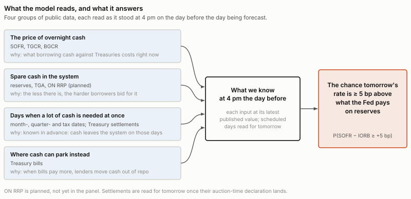
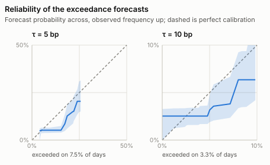
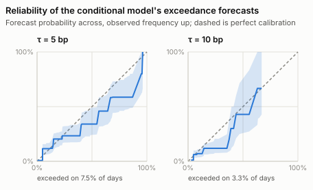
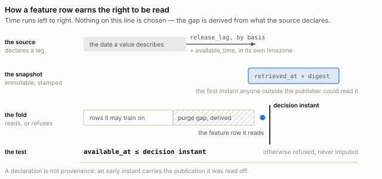
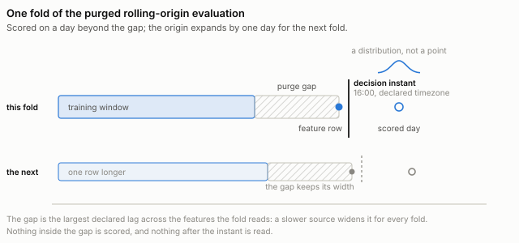

# Repo Market Model

[](https://github.com/eleonorabjornberg/repo-market-model/actions/workflows/tests.yml)
[](pyproject.toml)
[](pyproject.toml)
[](LICENSE)

[](https://colab.research.google.com/github/eleonorabjornberg/repo-market-model/blob/main/notebooks/00_overview.ipynb)

Every day, banks, dealers and money-market funds lend each other trillions of dollars overnight against U.S.
Treasury securities: the repo market. On most days the rate on that cash, SOFR, sits at or just below the rate the
Federal Reserve pays banks on their reserves, IORB. On some days — tax dates, large Treasury settlements, month- and
quarter-ends, above all when reserves are getting scarce — spare cash runs short and SOFR jumps above it, as it did in
September 2019. This project asks one question of public data only, using only what was public at 4 pm the day before:
**what is the chance that tomorrow SOFR is at least 5 basis points above IORB?** It is an academic and portfolio
project, built to show how such a forecast can be made and tested without borrowing from the future.

<picture>
  <source media="(prefers-color-scheme: dark)" srcset="docs/figures/overview-dark.svg">
  
</picture>

**Status, honestly.**
1. The published results read every input about a week late, so they are being re-scored under an as-of information rule ([`docs/pivot/lag-assessment.md`](docs/pivot/lag-assessment.md), [`docs/decisions/information-set.md`](docs/decisions/information-set.md)).
2. The data layer is unaffected: the panel rebuilds from tracked files, verifies against its published digest, and its leakage guards stand.
3. Every model figure below measures the old, stale design until the re-score is published, when those records move to an archive.

[`notebooks/00_overview.ipynb`](notebooks/00_overview.ipynb) is the tour: it rebuilds and verifies the panel, shows the
data by year, reproduces the lag finding, and scores the pressure-probability baselines, in under a minute on Colab.

<!-- generated: status -->
<!-- Generated by scripts/emit_results.py from PLAN.md. -->

**Where this is: phase 2 of 7 — Forecasting benchmarks and probabilistic ML (in progress), with phase 1, Public U.S. dataset, still open alongside it.** Its exit criterion is a model that beats persistence out of sample and remains calibrated in the tails. Next is phase 3, Latent reserves and payment needs. The machine-readable version is [`docs/status.json`](docs/status.json), regenerated in CI from the same headings rather than edited.

<!-- end generated: status -->

## In plain words

<!-- generated: headline -->
<!-- Generated by scripts/emit_results.py from docs/runs/. -->

- The forecasting machinery has been run end to end on real market data covering 2018-04-03 to 2026-09-03, and scored at **2080 separate decision points** — each one made only from information already public that afternoon, though about a week old: the as-of rule that reads the latest is being implemented.
- On that history, a simple benchmark — the latest value it read, carried forward — is wrong by **3.14 basis points on average**, and the range that error could plausibly take is 2.60 to 3.76 basis points.
- Its uncertainty bands are **too narrow**: a band meant to contain the outcome 90% of the time contained it 81.0% of the time. That gap is measured and unexplained, and is re-measured under the as-of rule before any verdict on it is repeated.
- The scoring itself has been checked against a case where the right answer is known in advance: a forecast with no information in it scores **0.000 skill**, exactly as it must. Every later claim of skill rests on that.

**Challenger models have scored better than the benchmark over the same decision points, but none of those results is yet reproduced end to end or broken down by date.** That is the honest state of the work, and it is why nothing here is a basis for a decision about money.

<!-- end generated: headline -->

## Key findings

<!-- generated: key-findings -->
<!-- Generated by scripts/emit_results.py from docs/runs/. Do not edit by hand:
     the block is regenerated from the run records and checked in the suite. -->

The baseline is characterised and the scoring is verified. **Phase 2's exit
criterion is recorded met on the interval evidence**; its tail clause is now
measured, and it fails. The conditional model carries Brier skill +0.213 against
climatology at 5 bp and -0.778 at 50 bp -- skill at the shoulder, none in the tail.

**Target.** The next-business-day value of the panel field `spread_bps` — the SOFR
to IORB spread in basis points — with the forecast made at 16:00 on the previous
business day. In these records every input was read at the row
dated at least seven calendar days before the scored day, which never leaks and is
about a week stale. The as-of information rule, which reads each input at its latest
public value, is being implemented; see `docs/pivot/lag-assessment.md`.

**Panel.** 2018-04-03 to 2026-09-03, 2104 rows, SHA-256 `d8b716cf5d76`.

**Evaluation.** Purged rolling origin, 6-day purge, **2080 forecast origins**,
first scored 2018-05-07, last scored 2026-09-03. Run at `ba381bb`.

| Measure | Benchmark | Value | 90% interval |
|---|---|---|---|
| Mean absolute error | persistence | 3.14 bp | 2.60 to 3.76 bp |
| CRPS | persistence | 2.56 bp | not intervalled |
| Interval coverage | nominal 90% | **81.0%** | 78.4% to 83.7% |
| Pinball loss, quantile 0.05 | persistence | 0.95 bp | not intervalled |
| Pinball loss, quantile 0.25 | persistence | 1.46 bp | not intervalled |
| Pinball loss, quantile 0.50 | persistence | 1.58 bp | not intervalled |
| Pinball loss, quantile 0.75 | persistence | 1.51 bp | not intervalled |
| Pinball loss, quantile 0.95 | persistence | 0.90 bp | not intervalled |

The interval is a stationary bootstrap, block length 5, 2000 replications, on the errors themselves; the folds overlap in horizon, so a formula assuming independent draws would report a narrower interval than the data supports.

**The coverage line is the honest one, and it is a finding.** A nominal 90% interval covered 81.0% of 2080 realised outcomes. Intervalled the same way as the error above (stationary bootstrap, block length 5, 2000 replications, seed 1410394720), the realised coverage lies between 78.4% and 83.7%, which excludes the nominal probability. What the gap is — a miscalibrated benchmark, or one a challenger will improve on — is open, and no verdict is asserted in the suite.

**Challengers against persistence.** Each challenger is scored on the same 2039 origins (minimum history 61, purge 6 days); persistence's CRPS is 2.53 bp. The difference is persistence's CRPS minus the challenger's, so a positive value favours the challenger; its interval is a stationary bootstrap (block length 5, 2000 replications) on the per-origin differences.

| Challenger | CRPS | Difference | 90% interval | Verdict |
|---|---|---|---|---|
| gbm (spread change lags `1`) | 1.98 bp | +0.55 bp | +0.28 to +0.89 bp | beats persistence |
| gbm (spread change lags `5`) | 1.98 bp | +0.55 bp | +0.28 to +0.88 bp | beats persistence |
| gbm | 1.99 bp | +0.54 bp | +0.28 to +0.88 bp | beats persistence |
| gbm (arx feature `declared`) | 2.00 bp | +0.52 bp | +0.26 to +0.86 bp | beats persistence |
| gbm (volatility feature `garch11`) | 2.00 bp | +0.52 bp | +0.26 to +0.86 bp | beats persistence |
| gbm (calibration `cross_conformal`, calibration folds `5`) | 2.02 bp | +0.51 bp | +0.23 to +0.86 bp | beats persistence |
| gbm (arx feature `declared`, calibration `cross_conformal`, calibration folds `5`) | 2.13 bp | +0.40 bp | +0.12 to +0.75 bp | beats persistence |
| rolling-residual (residual window `60`) | 2.48 bp | +0.05 bp | +0.02 to +0.09 bp | beats persistence |
| gbm (calibration `conformal`, calibration share `0.25`) | 2.71 bp | -0.18 bp | -0.49 to +0.21 bp | not distinguishable |
| gbm (calibration `conformal`, calibration share `0.25`, spread change lags `1`) | 2.72 bp | -0.19 bp | -0.50 to +0.19 bp | not distinguishable |
| gbm (calibration `conformal`, calibration share `0.25`, spread change lags `5`) | 2.73 bp | -0.20 bp | -0.51 to +0.18 bp | not distinguishable |
| gbm (calibration `conformal`, calibration share `0.25`, volatility feature `garch11`) | 2.76 bp | -0.23 bp | -0.54 to +0.16 bp | not distinguishable |
| arx with `sofr_volume` | 2.90 bp | -0.37 bp | -0.53 to -0.21 bp | loses to persistence |
| arx with `sofr_p25`, `sofr_p75` | 2.93 bp | -0.40 bp | -0.60 to -0.21 bp | loses to persistence |
| gbm (arx feature `declared`, calibration `conformal`, calibration share `0.25`) | 2.99 bp | -0.47 bp | -0.78 to -0.08 bp | loses to persistence |
| threshold (regime variable `sofr_volume`) | 4.20 bp | -1.67 bp | -4.04 to -0.02 bp | loses to persistence |
| threshold (regime variable `spread_bps`) | 4.69 bp | -2.16 bp | -4.46 to -0.53 bp | loses to persistence |

**Interval coverage on the same origins.**

| Model | Nominal | Realised coverage | 90% interval | Pinball loss, quantile 0.95 |
|---|---|---|---|---|
| gbm (arx feature `declared`, calibration `conformal`, calibration share `0.25`) | 90% | 86.3% | 83.9% to 88.4% | 1.516 bp |
| gbm (arx feature `declared`, calibration `cross_conformal`, calibration folds `5`) | 90% | 93.8% | 92.3% to 95.2% | 1.367 bp |
| gbm (arx feature `declared`) | 90% | 63.8% | 61.3% to 66.1% | 0.944 bp |
| gbm (calibration `conformal_asymmetric`, calibration share `0.35`) | 90% | 88.6% | 86.4% to 90.6% | 1.302 bp |
| gbm (calibration `conformal`, calibration share `0.25`) | 90% | 85.5% | 83.1% to 87.8% | 1.294 bp |
| gbm (calibration `conformal`, calibration share `0.35`) | 90% | 84.2% | 81.4% to 86.8% | 1.459 bp |
| gbm (calibration `cross_conformal_asymmetric`, calibration folds `5`) | 90% | 92.8% | 91.1% to 94.3% | 1.021 bp |
| gbm (calibration `cross_conformal`, calibration folds `5`) | 90% | 93.1% | 91.5% to 94.7% | 1.130 bp |
| gbm (calibration `cross_conformal_partial`, calibration folds `5`) | 90% | 91.8% | 90.0% to 93.4% | 1.117 bp |
| gbm | 90% | 65.8% | 63.3% to 68.1% | 0.943 bp |
| persistence | 90% | 81.6% | 78.7% to 84.2% | 0.889 bp |

A realised-coverage interval that excludes the nominal probability is a calibration finding. It is one for: gbm (arx feature `declared`, calibration `conformal`, calibration share `0.25`), gbm (arx feature `declared`, calibration `cross_conformal`, calibration folds `5`), gbm (arx feature `declared`), gbm (calibration `conformal`, calibration share `0.25`), gbm (calibration `conformal`, calibration share `0.35`), gbm (calibration `cross_conformal_asymmetric`, calibration folds `5`), gbm (calibration `cross_conformal`, calibration folds `5`), gbm (calibration `cross_conformal_partial`, calibration folds `5`), gbm, persistence.

**The control that licenses every future skill number.** A climatology scored against climatology must show no skill. Over the same 2080 origins its Brier skill score is 0.000 at every declared threshold (5, 10, 20, 50 bp), and its reference Brier score equals its own at each one. Any skill this repository later reports rests on that having been true first.

<picture>
  <source media="(prefers-color-scheme: dark)" srcset="docs/figures/reliability-dark.svg">
  
</picture>

CORP reliability curves with 90% stationary-bootstrap bands, one panel per declared stress threshold. The diagonal is perfect calibration; the base rate under each panel is how often the threshold was actually exceeded.

<!-- end generated: key-findings -->

## The tail clause, measured

Phase 2's exit criterion asks for a model that beats persistence out of sample **and
remains calibrated in the tails**. The interval half is recorded met. This is the other
half, taken on the panel against a climatology refitted on each fold — and it is a
negative result, published on the same terms as a positive one would have been.

<!-- generated: tail -->
<!-- Generated by scripts/emit_results.py from docs/runs/. Do not edit by hand:
     the block is regenerated from the run record and checked in the suite. -->

The conditional model's exceedance probabilities, scored over 2039 days at a 6-day purge against a climatology refitted on each fold's training rows. Run at `3eaecc8`.

| Threshold | Exceeded on | Brier skill vs climatology | 90% interval | Discrimination realised |
|---|---|---|---|---|
| τ = 5 bp | 8.0% of days | **+0.213** | +0.120 to +0.298 | 29.46% |
| τ = 10 bp | 3.4% of days | **-0.042** | -0.157 to +0.051 | 9.35% |
| τ = 20 bp | 1.0% of days | **-0.254** | -0.510 to -0.136 | 2.05% |
| τ = 50 bp | 0.2% of days | **-0.778** | -3.179 to -0.356 | 0.05% |

**Skill at the shoulder, none in the tail.** The skill interval excludes zero above climatology at 5 bp, and below it at 20 and 50 bp. The last column is resolution as a share of uncertainty -- how much of the discrimination a sample had available the forecasts actually realised. It is the honest form of the comparison, because resolution and uncertainty both collapse as the event gets rarer and a resolution quoted alone cannot tell a model that stopped discriminating from a sample with nothing left to discriminate. It falls from 29.46% at 5 bp to 0.05% at 50 bp: the forecasts stop carrying information exactly where the exit criterion asks them to.

**At 50 bp the record reports no log score.** The forecast assigned probability 0 to an event that occurred, so the mean negative log likelihood is infinite. It is not clipped: a clip replaces an infinite loss with a finite one chosen by whoever picked the clip, and hides the failure worth seeing.

<picture>
  <source media="(prefers-color-scheme: dark)" srcset="docs/figures/reliability-gbm-dark.svg">
  
</picture>

The same CORP reliability curves for the conditional model. Compare them with the climatology control above: a panel that hugs the diagonal at a low threshold and collapses onto a single forecast value at a high one is the table's resolution column, drawn.

<!-- end generated: tail -->

## Quick start

Requirements: Python 3.9, 3.10 or 3.11. The supported range is declared once in
`pyproject.toml` and is checked against the interpreter that runs the suite; 3.12
moves the published figures in their last digits and is outside it. The project intentionally uses
only the Python standard library for everything a published result depends on except
the gradient-boosted comparison, which needs the extra below; reproducing any other
needs no package installation. Phase 2's machine-learning candidates live
in `src/repo_model/ml.py` behind an optional extra, `pip install '.[ml]'` (numpy and
scikit-learn); today that is one, gradient-boosted conditional quantiles (`--model gbm`), with these opt-in
settings: a conformal interval (`--calibration conformal`, or `cross_conformal` with
`--calibration-folds K`), lagged spread changes (`--spread-change-lags K`), a GARCH(1,1)
variance fitted per fold (`--volatility-feature garch11`), an ARX one-step forecast fitted
per fold (`--arx-feature declared`), and a generalised Pareto tail continuing the law above
its top declared quantile, fitted per fold on the calibration rows (`--tail gpd`, with
`--calibration conformal` only), whose per-fold fit a `backtest` record reports. Not every
command takes every setting, and `exceedance-backtest` now takes all of them; its record reports
the per-fold tail account too. Key findings carries neither the ARX feature nor the tail: the ARX
feature is scored only outside the published set, and the tail is scored on the exceedance metric
alone (`docs/runs/exceedance_gbm_conformal_mh61.json` against
`docs/runs/exceedance_gbm_conformal_tail_gpd_mh61.json`), which is the metric it moves.

```bash
git clone https://github.com/eleonorabjornberg/repo-market-model.git
cd repo-market-model

PYTHONDONTWRITEBYTECODE=1 PYTHONPATH=src \
  python3 -B -m unittest discover -s tests

PYTHONPATH=src python3 -m repo_model.cli audit data/sample/daily_market.csv
PYTHONPATH=src python3 -m repo_model.cli backtest data/sample/daily_market.csv \
  --registry metadata/sources.json \
  --feature spread_bps \
  --decision-time 16:00 \
  --model persistence \
  --report /tmp/persistence_sample.json
```

The sample file is synthetic and exists only to make the workflow executable.
For data acquisition and exact reproducibility boundaries, see
[`REPRODUCIBILITY.md`](REPRODUCIBILITY.md).

## Why this project

Repo-market stress is a useful test of financial modeling discipline. The most
dangerous failure is often not a visibly broken model but a convincing backtest
that used information before it was actually available. This repository therefore
treats point-in-time availability, data provenance, release lags, revisions, and
holdout design as first-class parts of the model.

The intended research question is:

> Can publicly observable funding, reserve, Treasury-settlement, dealer,
> money-fund, and calendar variables forecast the next-day distribution of
> Treasury repo-market pressure, including transitions into the upper tail?

"Next-day" means a forecast made at 16:00 on the business day before the scored day. The
as-of information rule, which reads each input at its latest value public at that instant,
is being implemented; the published records read every input about a week earlier.

## Current status

Implemented:

- a versioned point-in-time data contract and panel builder;
- immutable, checksummed snapshots from official public sources;
- source, publication-lag, revision, and availability metadata;
- validation, missingness, provenance, and accounting checks;
- a persistence benchmark with empirical prediction intervals;
- purged rolling-origin evaluation for the main scoring holdout;
- frozen, checksummed event windows for separate knowledge holdouts;
- probabilistic metrics, including pinball loss, threshold-weighted CRPS,
  Brier skill, calibration diagnostics, and stationary-bootstrap intervals; and
- a standard-library test suite of leakage and mutation-oriented guards. Its
  size is deliberately not quoted here: a count transcribed into prose is stale
  at the next commit, and a repository about point-in-time honesty should not
  publish one. The badge above and the CI log are the count.

Still in progress:

- the as-of information rule ([`docs/decisions/information-set.md`](docs/decisions/information-set.md))
  and the re-score under it;
- validating complete SEC Form N-MFP monthly cross-sections; and
- producing event-window results. The out-of-sample results below are produced and
  published; the event-window evaluator cannot yet express the published model's
  calibration and tail settings, so no event-window number is claimed.

See [`METHODOLOGY.md`](METHODOLOGY.md) for what the harness guarantees, the limitations
still open, and a reading of the pre-as-of records.

## Research design

The project follows six rules:

1. Features must be timestamped by when they became observable, not merely by the
   date they describe.
2. Random train/test splits are prohibited; evaluation follows time.
3. Scoring holdouts and historically important event windows have different roles
   and are reported separately.
4. Missing observations, structural zeros, and unavailable cross-sections remain
   distinguishable.
5. Stress probabilities come from the same predictive distribution as the
   quantile forecasts, rather than from unrelated classifiers.
6. Predictive results are not presented as causal policy estimates.

The planned architecture is:

```text
public observations -> point-in-time panel -> probabilistic forecast
                              |                       |
                              +-> quality controls    +-> stress exceedance curve
                                                        and holdout evaluation
```

Two of those rules carry most of the weight, and both are easier to see than to state.
The first is what *observable* means. A value is not readable the moment it exists: its
source declares when it can first be read, and the purge that follows is derived from
that declaration rather than chosen.

<picture>
  <source media="(prefers-color-scheme: dark)" srcset="docs/figures/pipeline-dark.svg">
  
</picture>

The second is what one fold of the evaluation looks like once that gap is taken out of
it — and why nothing inside the gap is scored and nothing after the decision instant is
read.

<picture>
  <source media="(prefers-color-scheme: dark)" srcset="docs/figures/fold-dark.svg">
  
</picture>

Both figures show the design the published records were scored under, in which the purge
also chose the feature row. That is the week-old information set. Under the as-of rule
being implemented, each input is read at its latest value public at the decision instant,
and the purge only decides which training labels were observable.

Longer-term latent-liquidity, market-clearing, and network-stress components are
research directions, not completed features.

## People

- **Eleonora Björnberg** — author. She designed the model, the
  methodology and the workflow: the research design and the point-in-time contract,
  the evaluation protocol, the agent contract the code is developed under, validation
  (every guard and mutation record in the suite), interpretation of results, and review
  of all machine-written code before it lands.
- **Nicholas Beroud** — advisor on data selection and economic interpretation: which
  public series carry the funding market's mechanics, what each one means, and which
  open questions are questions of finance rather than of code. I designed and led the
  modelling, the methodology, the governance workflow, the implementation review and the
  evaluation.

The split matters to how this repository is read. Most of what is built here is data
engineering and evaluation discipline, and those are the parts a test suite can
defend. The judgments a suite cannot defend — whether a series measures the thing its
name suggests, whether an aggregate hides the mechanism that matters, which decisions
must be made before fitting rather than after — are finance judgments, and they are
his.

## Repository guide

Start here:

- [`notebooks/00_overview.ipynb`](notebooks/00_overview.ipynb) — the tour, runnable on
  Colab: the problem in plain words, the data, the lag finding and the pressure baselines.
- [`METHODOLOGY.md`](METHODOLOGY.md) defines the academic claims and evaluation
  protocol, what the harness guarantees, the limitations still open, a reading of the
  pre-as-of records, and related quantitative work.
- [`DATA.md`](DATA.md) maps public and restricted data sources.
- [`docs/PORTFOLIO_CASE_STUDY.md`](docs/PORTFOLIO_CASE_STUDY.md) is the same work written
  for a reader outside the project: the business question, the controls, the result and
  its limitations.
- [`PLAN.md`](PLAN.md) records the staged implementation roadmap, and is what
  [`docs/status.json`](docs/status.json) is generated from.
- [`examples/walkthrough.py`](examples/walkthrough.py) runs the pipeline end to end on
  the shipped sample data, in one command, with no installation.

Then, for how the work is controlled rather than what it claims:

- [`docs/DATA_QUALITY_DECISIONS.md`](docs/DATA_QUALITY_DECISIONS.md) records the data
  decisions each empirical claim rests on, including the ones still open.
- [`REPRODUCIBILITY.md`](REPRODUCIBILITY.md) separates what a clean clone can
  reproduce today from what a published empirical result would additionally require.
- [`docs/pivot/`](docs/pivot) — the lag finding, the redesign plan and the history of the
  first three weeks.
- [`docs/process/AGENT_CONTRACT.md`](docs/process/AGENT_CONTRACT.md) holds the panel
  schema, the as-of rule and the interfaces. Its two-track ownership split is retired
  ([`docs/decisions/workflow.md`](docs/decisions/workflow.md)) and kept as history;
  `CLAUDE.md` carries the standing rules for coding agents, and `AGENTS.md` points to it.
  These are engineering controls on how the code is written rather than research
  claims — and if you came to this repository for AI governance rather than for repo
  markets, they are the place to start.

## Development process and AI disclosure

Parts of the implementation were developed with AI coding agents. For the first three
weeks they worked in separate Git worktrees, under a human-owned contract naming the files
each could touch, checked in CI. Since the pivot, each agent session works on one branch
and one pull request, which merges into `main` only after CI and the author's review
([`docs/decisions/workflow.md`](docs/decisions/workflow.md)). The author and the advisor answer for different things:
the model, methodology, workflow, tests and code with Eleonora Björnberg; the choice
of data and its economic meaning with Nicholas Beroud. Any academic submission based
on this repository remains the author's academic responsibility, should follow the
relevant instructor's AI-use and citation requirements, and should disclose both the
AI-agent workflow and the collaboration.

## License

The code and repository documentation are available under the [MIT License](LICENSE).
Third-party data remain subject to the terms of their original providers and are
not redistributed in this repository.

